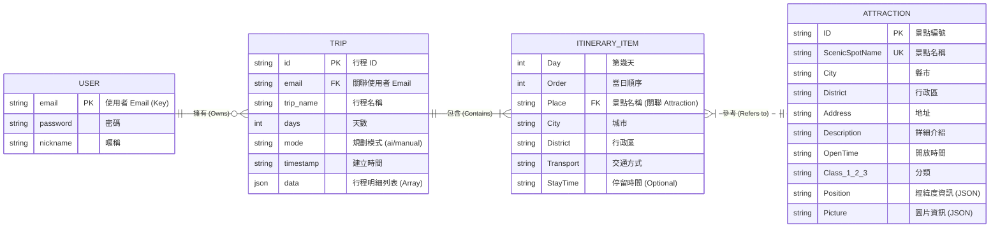
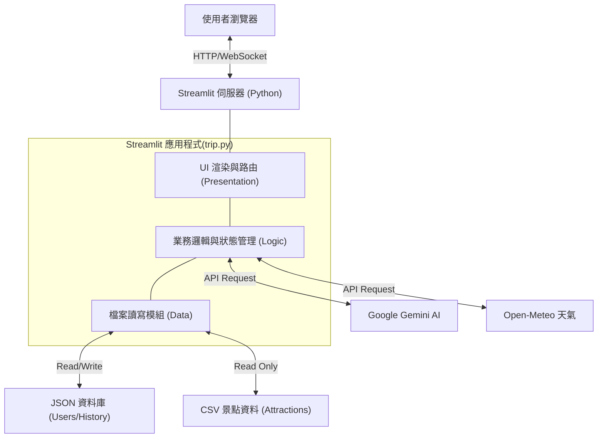
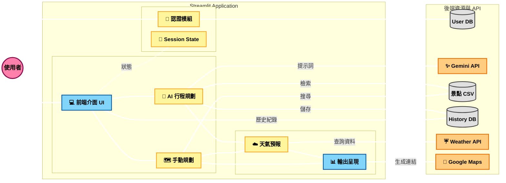

# 台灣旅遊小幫手 - 系統架構與資料庫設計文件
### 1.整理使用的api，資料筆數，適用什麼架設網站(架構)，網頁功能，製作理由
### 2.確認使用哪一個版本的python，Gemini
## 1. 實體關聯圖 (Entity Relationship Diagram)

此圖表展示了使用者資料 (`users_db.json`)、行程紀錄 (`history_db.json`) 與 景點資料庫 (`taiwan_attractions.csv`) 之間的關聯性。

## 2. 資料流向

## 3. 網頁架構圖 

