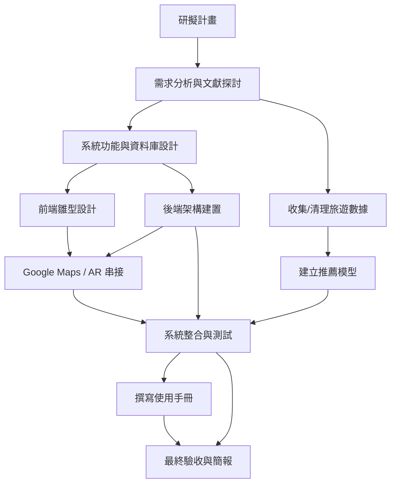

# 小組作業 2：智慧旅遊專題規劃
📅 專案期間：2025/10/01 ～ 2025/12/21  
👥 小組人數：3（前端、後端、資料分析）  
📌 專題內容：提供使用者個人化的旅遊推薦  

---

## 1. 小組成員與分工
| 成員 | 角色 | 任務內容 |
|------|------|----------|
| A | 前端 | UI/UX設計、頁面切版、Google Maps/AR互動串接 |
| B | 後端 | 資料庫設計、API串接、會員系統與推薦系統整合 |
| C | 資料分析 | 收集/清理旅遊數據、建立推薦模型、數據分析報表 |

---

## 2. 工作分解結構 (WBS)
| 編號 | 任務說明 | 需時 (天) | 前置任務 | 負責成員 |
|------|----------|-----------|-----------|----------|
| 1 | 研擬計畫 | 5 | - | 全員 |
| 2 | 需求分析與文獻探討 | 7 | 1 | 全員 |
| 3 | 系統功能與資料庫設計 | 10 | 2 | B |
| 4 | 收集/清理旅遊數據 | 14 | 2 | C |
| 5 | 前端雛型設計 | 12 | 3 | A |
| 6 | 後端架構建置 | 15 | 3 | B |
| 7 | 建立推薦模型 | 14 | 4 | C |
| 8 | Google Maps / AR 串接 | 10 | 5,6 | A,B |
| 9 | 系統整合與測試 | 14 | 6,7,8 | 全員 |
| 10 | 撰寫使用手冊 | 7 | 9 | A |
| 11 | 最終驗收與簡報 | 5 | 9,10 | 全員 |

---

## 3. PERT/CPM 圖


---

## 4. 甘特圖 (含成員分工顏色)
```mermaid
gantt
    title 智慧旅遊專題甘特圖
    dateFormat  YYYY-MM-DD
    axisFormat  %m/%d

    section 規劃階段
    研擬計畫(全員)           :a1, 2025-10-01, 5d
    需求分析與文獻探討(全員) :a2, after a1, 7d

    section 後端 (B)
    系統功能與資料庫設計(B)   :a3, after a2, 10d
    後端架構建置(B)           :a6, after a3, 15d

    section 資料分析 (C)
    收集/清理旅遊數據(C)      :a4, after a2, 14d
    建立推薦模型(C)          :a7, after a4, 14d

    section 前端 (A)
    前端雛型設計(A)          :a5, after a3, 12d
    Google Maps/AR串接(A,B)  :a8, after a5, 10d

    section 測試與交付 (全員)
    系統整合與測試(全員)     :a9, after a6, 14d
    撰寫使用手冊(A)          :a10, after a9, 7d
    最終驗收與簡報(全員)     :a11, after a10, 5d

    %% 定義顏色
    classDef all fill:#FFD580,stroke:#333,stroke-width:1px
    classDef A fill:#9FC5E8,stroke:#333,stroke-width:1px
    classDef B fill:#93C47D,stroke:#333,stroke-width:1px
    classDef C fill:#F6B26B,stroke:#333,stroke-width:1px

    %% 指派顏色
    class a1,a2,a9,a11 all
    class a5,a8,a10 A
    class a3,a6 B
    class a4,a7 C
```

---

## 5. 關鍵路徑 (Critical Path)
依據 WBS 與 PERT 計算，**關鍵路徑為：**  
**1 → 2 → 3 → 6 → 9 → 10 → 11**  
（總時長約 66 天，符合專案 10/1～12/21 的排程）

---
