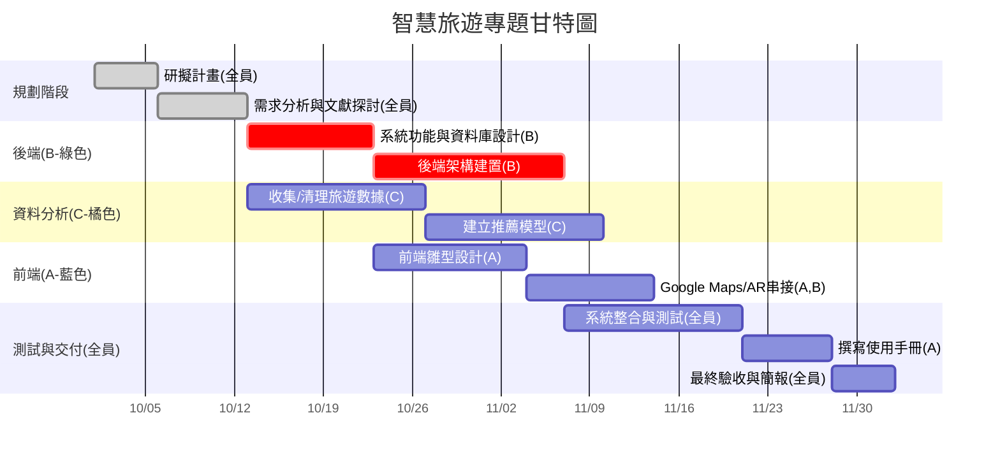

# 小組作業 2：智慧旅遊專題規劃
專案期間：2025/10/01 ～ 2025/12/21  
組員人數：3（前端、後端、資料分析）

---

## 1. 小組成員與分工
| 成員 | 任務內容 |
|------|----------|
|廖哲言 A (前端) | UI/UX設計、頁面切版、Google Maps/AR互動串接 |
|王胤祥 B (後端) | 資料庫設計、API串接、會員系統與推薦系統整合 |
|張哲綸 C (資料分析) | 收集/清理旅遊數據、建立推薦模型、數據分析報表 |

---

## 2. 工作分解結構 (WBS)
| 編號 | 任務說明 | 需時 (天) | 前置任務 | 負責成員 |
|------|----------|-----------|-----------|----------|
| 1 | 研擬計畫 | 5 | - | 全員 |
| 2 | 需求分析與文獻探討 | 7 | 1 | 全員 |
| 3 | 系統功能與資料庫設計 | 10 | 2 | B |
| 4 | 收集/清理旅遊數據 | 14 | 2 | C |
| 5 | 前端雛型設計 | 12 | 3 | A |
| 6 | 後端架構建置 | 15 | 3 | B |
| 7 | 建立推薦模型 | 14 | 4 | C |
| 8 | Google Maps / AR 串接 | 10 | 5,6 | A,B |
| 9 | 系統整合與測試 | 14 | 6,7,8 | 全員 |
| 10 | 撰寫使用手冊 | 7 | 9 | A |
| 11 | 最終驗收與簡報 | 5 | 9,10 | 全員 |

---

## 3. PERT/CPM 圖

---

## 4. 甘特圖 (含成員分工顏色)

---

