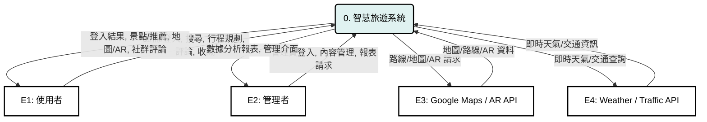
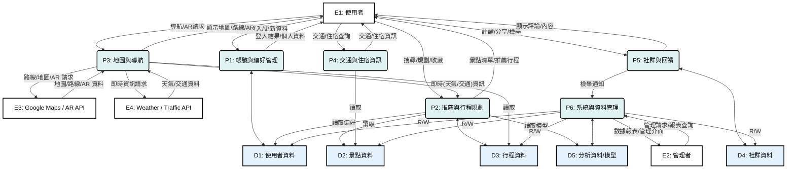

```mermaid
flowchart TD
    %% 節點定義
    P0("0. 智慧旅遊系統")

    E1["E1: 使用者"]
    E2["E2: 管理者"]
    E3["E3: Google Maps / AR API"]
    E4["E4: Weather / Traffic API"]

    %% 節點樣式
    classDef process fill:#e0f2f1,stroke:#000,stroke-width:2px,color:#000
    classDef entity fill:#fff,stroke:#000,stroke-width:2px,color:#000

    class P0 process
    class E1,E2,E3,E4 entity
    
    %% 資料流
    E1 -- "註冊/登入, 搜尋, 行程規劃, 評論, 收藏" --> P0
    P0 -- "登入結果, 景點/推薦, 地圖/AR, 社群評論" --> E1
    
    E2 -- "管理員登入, 內容管理, 報表請求" --> P0
    P0 -- "數據分析報表, 管理介面" --> E2
    
    P0 -- "路線/地圖/AR 請求" --> E3
    E3 -- "地圖/路線/AR 資料" --> P0
    
    P0 -- "即時天氣/交通查詢" --> E4
    E4 -- "即時天氣/交通資訊" --> P0
```

```mermaid
flowchart TD
    %% 外部實體
    E1["E1: 使用者"]
    E2["E2: 管理者"]
    E3["E3: Google Maps / AR API"]
    E4["E4: Weather / Traffic API"]

    %% 流程
    P1("P1: 帳號與偏好管理")
    P2("P2: 推薦與行程規劃")
    P3("P3: 地圖與導航")
    P4("P4: 交通與住宿資訊")
    P5("P5: 社群與回饋")
    P6("P6: 系統與資料管理")

    %% 資料儲存
    D1["D1: 使用者資料"]
    D2["D2: 景點資料"]
    D3["D3: 行程資料"]
    D4["D4: 社群資料"]
    D5["D5: 分析資料/模型"]

    %% 樣式定義
    classDef process fill:#e0f2f1,stroke:#000,stroke-width:2px,color:#000
    classDef entity fill:#fff,stroke:#000,stroke-width:2px,color:#000
    classDef datastore fill:#e3f2fd,stroke:#000,stroke-width:2px,color:#000

    class E1,E2,E3,E4 entity
    class P1,P2,P3,P4,P5,P6 process
    class D1,D2,D3,D4,D5 datastore

    %% 資料流
    E1 -- "註冊/登入/更新資料" --> P1
    P1 -- "登入結果/個人資料" --> E1
    E1 -- "搜尋/規劃/收藏" --> P2
    P2 -- "景點清單/推薦行程" --> E1
    E1 -- "導航/AR請求" --> P3
    P3 -- "顯示地圖/路線/AR" --> E1
    E1 -- "交通/住宿查詢" --> P4
    P4 -- "交通/住宿資訊" --> E1
    E1 -- "評論/分享/檢舉" --> P5
    P5 -- "顯示評論/內容" --> E1

    E2 -- "管理請求/報表查詢" --> P6
    P6 -- "數據報表/管理介面" --> E2

    P3 -- "路線/地圖/AR 請求" --> E3
    E3 -- "地圖/路線/AR 資料" --> P3
    P3 -- "即時資訊請求" --> E4
    E4 -- "天氣/交通資料" --> P3

    P3 -- "即時(天氣/交通)資訊" --> P2
    P5 -- "檢舉通知" --> P6

    %% 資料儲存流
    P1 <--> D1
    P2 -- "讀取偏好" --> D1
    P2 -- "讀取" --> D2
    P2 <--> D3
    P2 -- "讀取模型" --> D5
    P3 -- "讀取" --> D3
    P4 -- "讀取" --> D2
    P5 <--> D4
    P6 -- "R/W" --> D1
    P6 -- "R/W" --> D2
    P6 -- "R/W" --> D3
    P6 -- "R/W" --> D4
    P6 <--> D5
```
