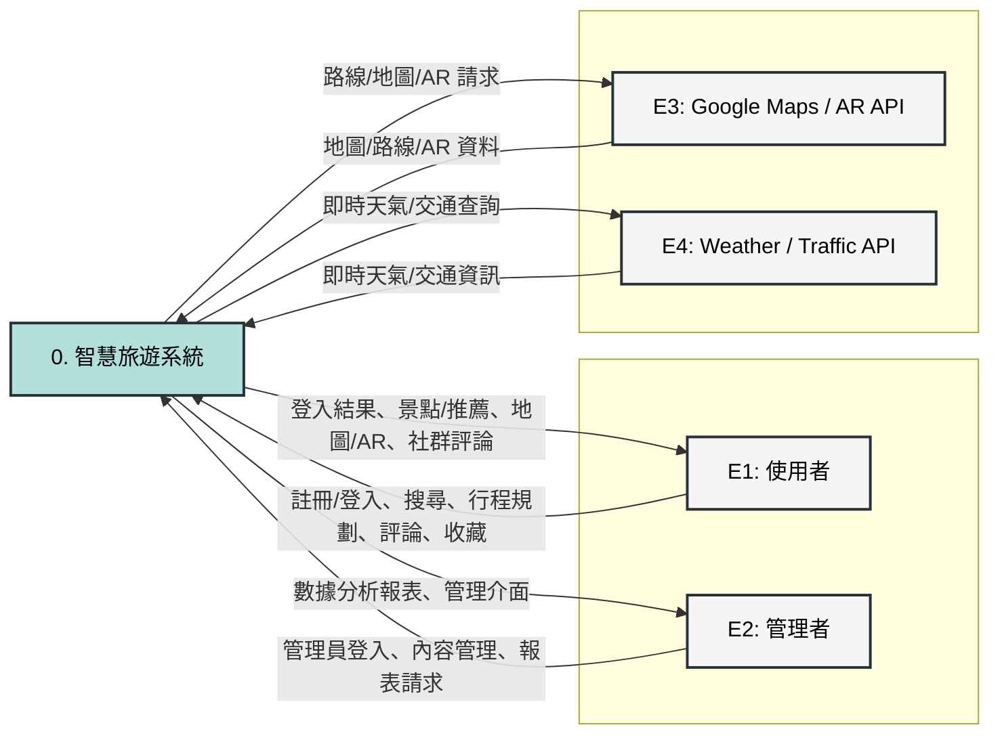
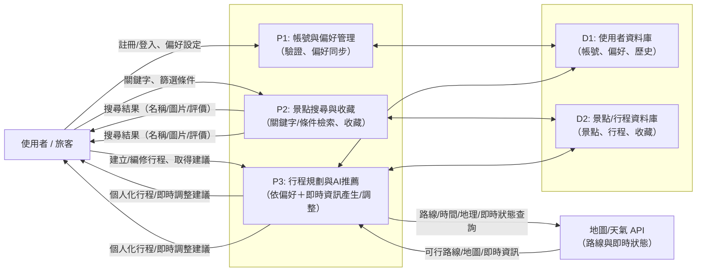

## 1. 系統環境圖 (Data Flow Diagram, Context Diagram)

```mermaid
flowchart LR
    %% 方向採 LR 來營造「左右外部、中央系統」的版面
    %% === 節點 ===
    P0["0. 智慧旅遊系統"]

    subgraph EXL[ ]
      direction TB
      E1["E1: 使用者"]
      E2["E2: 管理者"]
    end

    subgraph EXR[ ]
      direction TB
      E3["E3: Google Maps / AR API"]
      E4["E4: Weather / Traffic API"]
    end

    %% === 樣式 ===
    classDef system    fill:#b2dfdb,stroke:#263238,stroke-width:2px,color:#000
    classDef entity    fill:#f5f5f5,stroke:#263238,stroke-width:2px,color:#000
    class P0 system
    class E1,E2,E3,E4 entity

    %% === 資料流（加粗箭頭、清楚標籤）===
    E1 -- "註冊/登入、搜尋、行程規劃、評論、收藏" --> P0
    P0 -- "登入結果、景點/推薦、地圖/AR、社群評論" --> E1

    E2 -- "管理員登入、內容管理、報表請求" --> P0
    P0 -- "數據分析報表、管理介面" --> E2

    P0 -- "路線/地圖/AR 請求" --> E3
    E3 -- "地圖/路線/AR 資料" --> P0

    P0 -- "即時天氣/交通查詢" --> E4
    E4 -- "即時天氣/交通資訊" --> P0
```

## 2.系統流程圖 0 (Data Flow Diagram, Level 0)

```mermaid
flowchart LR
    %% DFD Level 0（精簡版＋重點註記）
    %% 佈局：左外部→核心流程→右外部；資料庫置中靠下

    %% 外部實體
    U["使用者 / 旅客"]
    M["地圖/天氣 API<br/>（路線與即時狀態）"]

    %% 核心流程
    subgraph PROC[ ]
      direction TB
      P1["P1: 帳號與偏好管理<br/>（驗證、偏好同步）"]
      P2["P2: 景點搜尋與收藏<br/>（關鍵字/條件檢索、收藏）"]
      P3["P3: 行程規劃與AI推薦<br/>（依偏好＋即時資訊產生/調整）"]
    end

    %% 資料儲存
    subgraph DATA[ ]
      direction LR
      D1["D1: 使用者資料庫<br/>（帳號、偏好、歷史）"]
      D2["D2: 景點/行程資料庫<br/>（景點、行程、收藏）"]
    end

    %% 外部互動（資料流）
    U -- "註冊/登入、偏好設定" --> P1
    U -- "關鍵字、篩選條件" --> P2
    U -- "建立/編修行程、取得建議" --> P3

    %% API 串接（資料流）
    P3 -- "路線/時間/地理/即時狀態查詢" --> M
    M -- "可行路線/地圖/即時資訊" --> P3

    %% 流程 <-> 資料庫
    P1 <--> D1
    P2 <--> D2
    P3 <--> D1
    P3 <--> D2

    %% 給使用者的輸出
    P2 -- "搜尋結果（名稱/圖片/評價）" --> U
    P3 -- "個人化行程/即時調整建議" --> U

    %% 給使用者的輸出
    P2 -- "搜尋結果（名稱/圖片/評價）" --> U
    P3 -- "個人化行程/即時調整建議" --> U
```
