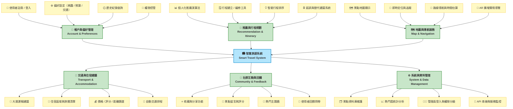
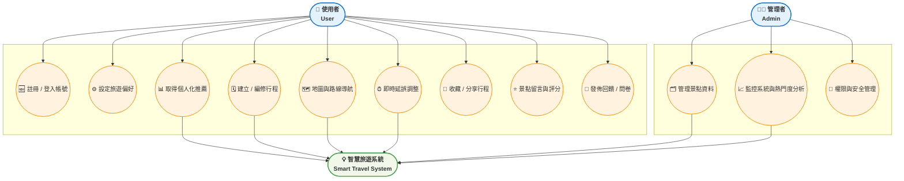

HW3:智慧旅遊功能性需求與非功能性需求
# 一、功能性需求 (Functional Requirements)

1. 使用者帳號與會員管理 (User & Account Management)
- **F1.1** 系統必須允許使用者註冊帳號並登入（註冊 / 登入）。  
- **F1.2** 使用者可編輯個人資料，包括暱稱、旅遊偏好與聯絡方式（個人資料管理）。  
- **F1.3** 系統應提供忘記密碼與修改密碼的功能（帳號維護）。  
- **F1.4** 系統需區分一般使用者與管理者權限（權限管理）。  

2. 景點搜尋與收藏 (Attraction Search & Favorites)
- **F2.1** 系統應提供搜尋功能，允許使用者以關鍵字查詢景點（搜尋景點）。  
- **F2.2** 搜尋結果應顯示景點名稱、圖片、地點與評價。  
- **F2.3** 使用者可將喜歡的景點加入收藏清單（我的收藏）。  
- **F2.4** 系統應允許使用者從「我的收藏」移除景點。  

3. 行程規劃與建議 (Trip Planning & Recommendation)
- **F3.1** 系統必須允許使用者建立自訂旅遊行程（新增行程）。  
- **F3.2** 系統可根據使用者偏好與歷史紀錄，提供推薦景點（AI 推薦）。  
- **F3.3** 使用者可調整每日行程順序與時間（行程編輯）。  
- **F3.4** 系統可根據天氣或交通狀況即時更新建議（動態調整）。  

4. 評價與社群互動 (Review & Social Interaction)
- **F4.1** 使用者可對景點進行評分與留言（撰寫評論）。  
- **F4.2** 系統應允許使用者瀏覽他人評論與平均評價（閱讀評論）。  
- **F4.3** 使用者可分享旅遊經驗或照片至平台（分享功能）。  
- **F4.4** 系統應支援檢舉與刪除不當內容（內容管理）。  

---

# 二、非功能性需求 (Non-Functional Requirements)

1. 效能 (Performance)
- **N1.1** 系統在查詢、上架或交易操作時，回應時間不得超過 3 秒。  
- **N1.2** 系統必須支援至少 200 位使用者同時上線操作。  
- **N1.3** 搜尋結果頁面應在 2 秒內完成載入，確保良好的使用體驗。  

2. 可用性 (Usability)
- **N2.1** 系統介面設計需簡潔直覺、易於操作，避免過多步驟。  
- **N2.2** 介面應支援多語系切換（中文 / 英文）。  
- **N2.3** 必須支援行動裝置（RWD 自適應網頁設計），提供一致的體驗。  

3. 安全性 (Security)
- **N3.1** 所有使用者密碼必須以加密方式（例如 SHA-256）儲存。  
- **N3.2** 系統需實作登入驗證與權限控管機制，防止未授權存取。  
- **N3.3** 所有交易與個資傳輸需使用 HTTPS 加密連線。  
- **N3.4** 若偵測異常登入，應立即鎖定帳號並通知使用者。  

4. 可維護性 (Maintainability)
- **N4.1** 系統架構採用模組化設計，方便後續功能擴充與除錯。  
- **N4.2** 程式碼需遵循統一的命名與版本控制規範（如 GitFlow）。  
- **N4.3** 每次版本更新需經過自動化測試（Unit Test / Integration Test）。
    
# 三、功能分解圖(functional decomposition diagram, FDD)

#四、使用案例

# 五、使用案例說明 (Use Case Descriptions)

## 使用案例 UC001：使用者登入系統
| 欄位 | 內容 |
|------|------|
| **使用案例編號** | UC001 |
| **功能編號** | F1.1 |
| **前置條件** | 使用者尚未登入系統 |
| **後置條件** | 登入成功後進入首頁，顯示個人推薦行程 |
| **基本流程** | 1. 使用者輸入帳密 → 2. 系統驗證 → 3. 顯示登入成功畫面與推薦內容 |

---

## 使用案例 UC002：搜尋景點
| 欄位 | 內容 |
|------|------|
| **使用案例編號** | UC002 |
| **功能編號** | F2.1 |
| **前置條件** | 使用者已登入或瀏覽首頁 |
| **後置條件** | 顯示符合關鍵字的景點清單 |
| **基本流程** | 1. 使用者輸入關鍵字 → 2. 系統執行搜尋 → 3. 顯示景點名稱、地點與圖片 |

---

## 使用案例 UC003：收藏景點
| 欄位 | 內容 |
|------|------|
| **使用案例編號** | UC003 |
| **功能編號** | F2.3 |
| **前置條件** | 使用者已登入 |
| **後置條件** | 收藏成功並顯示於個人清單 |
| **基本流程** | 1. 點擊收藏按鈕 → 2. 系統更新資料庫 → 3. 顯示操作成功提示 |

---

## 使用案例 UC004：建立自訂行程
| 欄位 | 內容 |
|------|------|
| **使用案例編號** | UC004 |
| **功能編號** | F3.1 |
| **前置條件** | 使用者已登入並進入行程規劃頁面 |
| **後置條件** | 新增的行程成功儲存並顯示在行程清單中 |
| **基本流程** | 1. 使用者選擇日期與景點 → 2. 輸入行程名稱與備註 → 3. 點擊「新增行程」並儲存成功 |

---

## 使用案例 UC005：AI 推薦景點
| 欄位 | 內容 |
|------|------|
| **使用案例編號** | UC005 |
| **功能編號** | F3.2 |
| **前置條件** | 使用者已登入系統 |
| **後置條件** | 系統根據歷史偏好與地點資料生成推薦清單 |
| **基本流程** | 1. 系統讀取使用者偏好 → 2. 執行推薦演算法 → 3. 顯示推薦行程與景點 |

---

## 使用案例 UC006：動態更新路線建議
| 欄位 | 內容 |
|------|------|
| **使用案例編號** | UC006 |
| **功能編號** | F3.4 |
| **前置條件** | 使用者選擇旅遊地點 |
| **後置條件** | 系統顯示最佳路線與交通方式 |
| **基本流程** | 1. 使用者輸入起訖點 → 2. 系統調用 Google Maps API → 3. 顯示可行路線與交通建議 |

---

## 使用案例 UC007：撰寫評論
| 欄位 | 內容 |
|------|------|
| **使用案例編號** | UC007 |
| **功能編號** | F4.1 |
| **前置條件** | 使用者已造訪景點並登入系統 |
| **後置條件** | 評論成功上傳並顯示於該景點頁面 |
| **基本流程** | 1. 使用者輸入評分與留言 → 2. 系統驗證內容 → 3. 儲存評論並更新平均評分 |

---

## 使用案例 UC008：分享旅遊內容
| 欄位 | 內容 |
|------|------|
| **使用案例編號** | UC008 |
| **功能編號** | F4.3 |
| **前置條件** | 使用者開啟手機鏡頭 |
| **後置條件** | 顯示該景點的虛擬導覽資訊或拍照特效 |
| **基本流程** | 1. 使用者選擇景點 → 2. 啟用 AR 模式 → 3. 顯示導覽內容與互動特效 |
