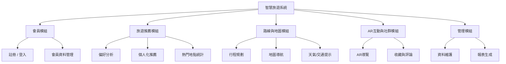
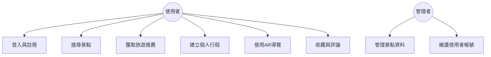

# HW3:智慧旅遊功能性需求與非功能性需求
## 一、功能性需求 (Functional Requirements)
1. 使用者帳號與會員管理 (User & Account Management)
- 系統必須允許使用者註冊帳號並登入（註冊 / 登入）。
- 使用者可編輯個人資料，包括暱稱、旅遊偏好與聯絡方式（個人資料管理）。
- 系統應提供忘記密碼與修改密碼的功能（帳號維護）。
- 系統需區分一般使用者與管理者權限（權限管理）。
2. 景點搜尋與收藏 (Attraction Search & Favorites)
- 系統應提供搜尋功能，允許使用者以關鍵字查詢景點（搜尋景點）。
- 搜尋結果應顯示景點名稱、圖片、地點與評價。
- 使用者可將喜歡的景點加入收藏清單（我的收藏）。
- 系統應允許使用者從「我的收藏」移除景點。
3. 行程規劃與建議 (Trip Planning & Recommendation)
- 系統必須允許使用者建立自訂旅遊行程（新增行程）。
- 系統可根據使用者偏好與歷史紀錄，提供推薦景點（AI 推薦）。
- 使用者可調整每日行程順序與時間（行程編輯）。
- 系統可根據天氣或交通狀況即時更新建議（動態調整）。
4. 評價與社群互動 (Review & Social Interaction)
- 使用者可對景點進行評分與留言（撰寫評論）。
- 系統應允許使用者瀏覽他人評論與平均評價（閱讀評論）。
- 使用者可分享旅遊經驗或照片至平台（分享功能）。
- 系統應支援檢舉與刪除不當內容（內容管理）。

## 二、非功能性需求 (Non-Functional Requirements)
1. 效能 (Performance)
- 系統在查詢、上架或交易操作時，回應時間不得超過 3 秒。
- 系統必須支援 至少 200 位使用者同時上線操作。
- 搜尋結果頁面應在 2 秒內完成載入，確保良好的使用體驗。
2. 可用性 (Usability)
- 系統介面設計需簡潔直覺、易於操作，避免過多步驟。
- 介面應支援 多語系切換（中文 / 英文）。
- 必須支援行動裝置（RWD 自適應網頁設計），提供一致的體驗。
3. 安全性 (Security)
- 所有使用者密碼必須以 加密方式（例如 SHA-256） 儲存。
- 系統需實作 登入驗證與權限控管機制，防止未授權存取。
- 所有交易與個資傳輸需使用 HTTPS 加密連線。
- 若偵測異常登入，應立即鎖定帳號並通知使用者。
4. 可維護性 (Maintainability)
- 系統架構採用 模組化設計，方便後續功能擴充與除錯。
- 程式碼需遵循統一的命名與版本控制規範（如 GitFlow）。
- 每次版本更新需經過自動化測試（Unit Test / Integration Test）。

## 三、功能分解圖(functional decomposition diagram, FDD)

## 四、使用案例
- 使用案例圖

- 使用案例說明

| 欄位 | 內容 |
| --- | --- |
| 使用案例編號 | UC001 |
| 功能編號 | F-001 |
| 前置條件 | 使用者尚未登入系統 |
| 後置條件 | 登入成功後進入首頁，顯示個人推薦行程 |
| 基本流程 | 1. 使用者輸入帳密 → 2. 系統驗證 → 3. 顯示登入成功畫面與推薦內容 |

| 欄位 | 內容 |
| --- | --- |
| 使用案例編號 | UC002 |
| 功能編號 | F-003 |
| 前置條件 | 使用者已登入系統 |
| 後置條件 | 系統根據歷史偏好與地點資料生成推薦清單 |
| 基本流程 | 1. 系統讀取使用者偏好 → 2. 執行推薦演算法 → 3. 顯示推薦行程與景點 |

| 欄位 | 內容 |
| --- | --- |
| 使用案例編號 | UC003 |
| 功能編號 | F-004 |
| 前置條件 | 使用者選擇旅遊地點 |
| 後置條件 | 系統顯示最佳路線與交通方式 |
| 基本流程 | 1. 使用者輸入起訖點 → 2. 系統調用 Google Maps API → 3. 顯示可行路線與交通建議 |

| 欄位 | 內容 |
| --- | --- |
| 使用案例編號 | UC004 |
| 功能編號 | F-005 |
| 前置條件 | 使用者開啟手機鏡頭 |
| 後置條件 | 顯示該景點的虛擬導覽資訊或拍照特效 |
| 基本流程 | 1. 使用者選擇景點 → 2. 啟用AR模式 → 3. 顯示導覽內容與互動特效 |

| 欄位 | 內容  |
| --- | --- |
| 使用案例編號 | UC005 |
| 功能編號 | F-006 |
| 前置條件 | 使用者登入 |
| 後置條件 | 收藏成功並顯示於個人清單 |
| 基本流程 | 1. 點擊收藏或評論 → 2. 系統更新資料庫 → 3. 顯示操作成功提示 |
