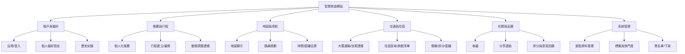
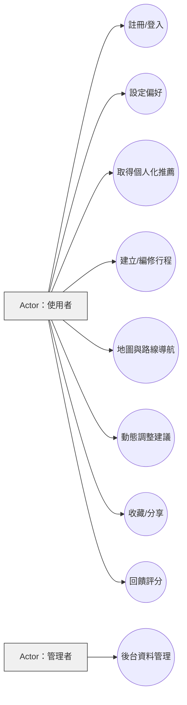

# hw3 — 智慧旅遊專題規劃（個人化旅遊推薦）

> 目標：提供使用者**個人化旅遊推薦**，協助規劃路線、交通與住宿，並在旅途中可**動態調整行程**。

---

## 1. 功能性需求（Functional Requirements）

| 編號 | 名稱 | 說明 | 驗收準則 |
|---|---|---|---|
| F-001 | 使用者註冊/登入 | 支援 Email/密碼註冊、登入與登出；驗證重複帳號 | 成功註冊/登入/登出；錯誤時顯示訊息 |
| F-002 | 偏好設定 | 使用者可設定預算、興趣(美食/自然/文化等)、交通偏好、旅伴類型 | 儲存並影響推薦結果；可隨時修改 |
| F-003 | 個人化推薦 | 依偏好、歷史行為與地理位置生成推薦景點/行程 | 於 2 秒內產生至少 10 筆候選並可排序 |
| F-004 | 行程規劃 | 讓使用者建立/編修多日行程，含景點順序、停留時間 | 可新增/刪除/拖曳重排；自動計算時間 |
| F-005 | 路線與地圖 | 顯示地圖、路線導航、距離與時間估算；支援步行/大眾運輸/自駕 | 路線與時間估算可見且可切換模式 |
| F-006 | 動態調整建議 | 行程延誤或場館休息時，提供即時替代/重排建議 | 可一鍵接受建議並更新行程 |
| F-007 | 交通/住宿建議 | 依行程給出交通建議與住宿區域/旅館清單 | 顯示價格區間與距離/評分等資訊 |
| F-008 | 收藏與分享 | 收藏景點/行程；可生成分享連結 | 收藏清單可管理；他人可檢視分享頁 |
| F-009 | 意見回饋 | 針對推薦/景點給評分與回饋 | 評分影響後續推薦；可檢視歷史回饋 |
| F-010 | 後台管理 | 管理景點資料、標籤、黑名單、熱門度 | 可查詢/新增/編修/下架資料 |

---

## 2. 非功能性需求（Non-Functional Requirements）

| 編號 | 類別 | 需求 | 說明/驗收 |
|---|---|---|---|
| NF-001 | 效能 | 首屏載入 ≤ 3s、推薦回應 ≤ 2s | 以 Lighthouse/監控日誌驗證 |
| NF-002 | 可用性 | 服務月可用度 ≥ 99.5% | 以 uptime 監控報表佐證 |
| NF-003 | 安全性 | JWT 驗證、密碼雜湊、HTTPS | 未授權請求拒絕；密碼不明文 |
| NF-004 | 隱私 | 個資最小蒐集、同意撤回與刪除 | 提供刪除帳號與資料匯出 |
| NF-005 | 可維護性 | 後端測試覆蓋率 ≥ 70% | CI 報告須通過 |
| NF-006 | 擴充性 | 可水平擴充推薦/地圖查詢服務 | 以容器化與負載平衡部署 |
| NF-007 | 相容性 | RWD 支援桌機/手機常見解析度 | 三種斷點驗證版面無破版 |
| NF-008 | 可用性/UX | 關鍵流程（搜尋→加入行程）≤ 4 步 | 問卷/可用性測試完成率 ≥ 90% |

---

## 3. 功能分解圖（FDD, Functional Decomposition Diagram）

---

## 4. 使用案例圖（Use Case Diagram）

---

## 5. 使用案例說明（至少三個）

### UC-001 註冊/登入
| 欄位 | 內容 |
|---|---|
| 角色 | 使用者 |
| 前置條件 | 使用者尚未登入 |
| 基本流程 | 1. 輸入帳密 → 2. 系統驗證 → 3. 登入成功導向首頁 |
| 後置條件 | 登入狀態維持於瀏覽器 |
| 擴充點 | 支援第三方登入 |

### UC-002 偏好設定
| 欄位 | 內容 |
|---|---|
| 角色 | 使用者 |
| 前置條件 | 已登入 |
| 基本流程 | 1. 選擇偏好 → 2. 儲存 |
| 後置條件 | 偏好影響推薦結果 |

### UC-003 個人化推薦
| 欄位 | 內容 |
|---|---|
| 角色 | 使用者 |
| 前置條件 | 已登入且有偏好 |
| 基本流程 | 1. 點擊「生成推薦」 → 2. 後端推薦服務回傳結果 |
| 後置條件 | 顯示景點卡片與評分 |

### UC-004 行程建立/編修
| 欄位 | 內容 |
|---|---|
| 角色 | 使用者 |
| 前置條件 | 已登入 |
| 基本流程 | 新增行程 → 加入景點 → 拖曳排序 → 儲存 |
| 後置條件 | 行程更新可供地圖導航使用 |

### UC-005 動態調整建議
| 欄位 | 內容 |
|---|---|
| 角色 | 使用者 |
| 前置條件 | 行程進行中 |
| 基本流程 | 偵測延誤 → 顯示替代方案 → 一鍵更新 |
| 後置條件 | 行程時間重新計算 |

---

