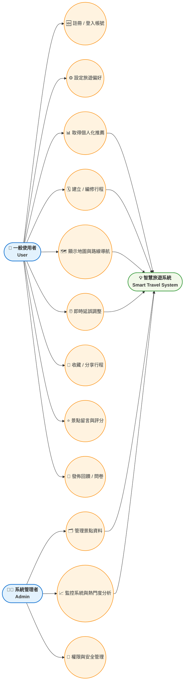

# hw3 — 智慧旅遊專題規劃（個人化旅遊推薦）

> 目標：提供使用者**個人化旅遊推薦**，協助規劃路線、交通與住宿，並在旅途中可**動態調整行程**。

- 日期：2025-10-20（Asia/Taipei）
- 分工角色：
  - **前端**：UI/UX 設計、頁面切版、Google Maps / AR 互動串接
  - **後端**：資料庫設計、API 串接、會員系統與推薦系統整合
  - **資料分析**：收集/清理旅遊數據、建立推薦模型、數據分析與報表

---

## 1. 功能性需求（Functional Requirements）

| 編號 | 名稱 | 說明 | 驗收準則 |
|---|---|---|---|
| F-001 | 使用者註冊/登入 | 支援 Email/密碼註冊、登入與登出；驗證重複帳號 | 成功註冊/登入/登出；錯誤時顯示訊息 |
| F-002 | 偏好設定 | 使用者可設定預算、興趣(美食/自然/文化等)、交通偏好、旅伴類型 | 儲存並影響推薦結果；可隨時修改 |
| F-003 | 個人化推薦 | 依偏好、歷史行為與地理位置生成推薦景點/行程 | 於 2 秒內產生至少 10 筆候選並可排序 |
| F-004 | 行程規劃 | 讓使用者建立/編修多日行程，含景點順序、停留時間 | 可新增/刪除/拖曳重排；自動計算時間 |
| F-005 | 路線與地圖 | 顯示地圖、路線導航、距離與時間估算；支援步行/大眾運輸/自駕 | 路線與時間估算可見且可切換模式 |
| F-006 | 動態調整建議 | 行程延誤或場館休息時，提供即時替代/重排建議 | 可一鍵接受建議並更新行程 |
| F-007 | 交通/住宿建議 | 依行程給出交通建議與住宿區域/旅館清單 | 顯示價格區間與距離/評分等資訊 |
| F-008 | 收藏與分享 | 收藏景點/行程；可生成分享連結 | 收藏清單可管理；他人可檢視分享頁 |
| F-009 | 意見回饋 | 針對推薦/景點給評分與回饋 | 評分影響後續推薦；可檢視歷史回饋 |
| F-010 | 後台管理 | 管理景點資料、標籤、黑名單、熱門度 | 可查詢/新增/編修/下架資料 |

---

## 2. 非功能性需求（Non-Functional Requirements）

| 編號 | 類別 | 需求 | 說明/驗收 |
|---|---|---|---|
| NF-001 | 效能 | 首屏載入 ≤ 3s、推薦回應 ≤ 2s | 以 Lighthouse/監控日誌驗證 |
| NF-002 | 可用性 | 服務月可用度 ≥ 99.5% | 以 uptime 監控報表佐證 |
| NF-003 | 安全性 | JWT 驗證、密碼雜湊、HTTPS | 未授權請求拒絕；密碼不明文 |
| NF-004 | 隱私 | 個資最小蒐集、同意撤回與刪除 | 提供刪除帳號與資料匯出 |
| NF-005 | 可維護性 | 後端測試覆蓋率 ≥ 70% | CI 報告須通過 |
| NF-006 | 擴充性 | 可水平擴充推薦/地圖查詢服務 | 以容器化與負載平衡部署 |
| NF-007 | 相容性 | RWD 支援桌機/手機常見解析度 | 三種斷點驗證版面無破版 |
| NF-008 | 可用性/UX | 關鍵流程（搜尋→加入行程）≤ 4 步 | 問卷/可用性測試完成率 ≥ 90% |

---

## 🌳 3. 功能分解圖（Functional Decomposition Diagram, FDD）

```mermaid
flowchart TD
    A[🏙️ 智慧旅遊網站<br>Smart Travel Platform]:::main

    A --> A1[👤 帳戶與偏好管理<br>User Account & Preferences]
    A --> A2[🧭 推薦與行程規劃<br>Recommendation & Itinerary Planning]
    A --> A3[🗺️ 地圖與導航服務<br>Map & Navigation Service]
    A --> A4[🚉 交通與住宿建議<br>Transport & Accommodation]
    A --> A5[💬 社群互動與回饋<br>Community & Feedback]
    A --> A6[⚙️ 系統與資料後台<br>System & Data Management]

    A1 --> A1a[🆕 使用者註冊 / 登入<br>Sign up / Login]
    A1 --> A1b[⚙️ 偏好設定（興趣/預算/交通）<br>Preference Setup]
    A1 --> A1c[🕒 歷史紀錄查詢<br>Activity History]
    A1 --> A1d[🔒 JWT 驗證與權限控管<br>Authentication Layer]

    A2 --> A2a[📊 個人化推薦引擎<br>Personalized Recommendation Engine]
    A2 --> A2b[🗓️ 行程建立 / 編修工具<br>Trip Builder / Editor]
    A2 --> A2c[⏰ 延誤與替代建議<br>Dynamic Adjustment Suggestion]
    A2 --> A2d[💡 多日行程管理<br>Multi-day Planner]

    A3 --> A3a[🗺️ 景點地圖顯示<br>Interactive Map]
    A3 --> A3b[🚗 路線導航與距離估算<br>Route Optimization]
    A3 --> A3c[🧭 Google Maps / AR 導覽整合<br>AR Navigation Integration]
    A3 --> A3d[📍 即時定位與地理標記<br>Real-time Location Tracking]

    A4 --> A4a[🚆 大眾運輸建議<br>Public Transport Recommendation]
    A4 --> A4b[🏨 住宿區域與旅館推薦<br>Hotel Area & Stay Recommendation]
    A4 --> A4c[💰 價格、距離與評分篩選<br>Price / Rating / Distance Filter]
    A4 --> A4d[📅 自動排程與移動時間計算<br>Travel Time Calculation]

    A5 --> A5a[⭐ 收藏與分享<br>Favorites & Sharing]
    A5 --> A5b[💭 景點留言與評分<br>Review & Comment System]
    A5 --> A5c[🧾 使用者體驗問卷<br>User Feedback Form]
    A5 --> A5d[📣 熱門主題 / 活動牆<br>Trending Posts Wall]

    A6 --> A6a[🗂️ 景點資料庫管理<br>Destination Database]
    A6 --> A6b[📈 熱門度統計與分析<br>Popularity Analysis]
    A6 --> A6c[👩‍💻 管理員登入與權限分級<br>Admin Access Control]
    A6 --> A6d[🔄 API 串接與日誌監控<br>API Logs & Monitoring]

    classDef main fill:#ffe082,stroke:#333,stroke-width:2px,font-weight:bold;
    classDef layer1 fill:#ffecb3,stroke:#444,stroke-width:1.5px;
    classDef layer2 fill:#fff8e1,stroke:#aaa,stroke-width:1px;
    class A1,A2,A3,A4,A5,A6 layer1;
    class A1a,A1b,A1c,A1d,A2a,A2b,A2c,A2d,A3a,A3b,A3c,A3d,A4a,A4b,A4c,A4d,A5a,A5b,A5c,A5d,A6a,A6b,A6c,A6d layer2;
```

---

## 🎭 4. 使用案例圖（Use Case Diagram）

---

## 5. 使用案例說明（片段）

（略，同前版本，可保留原表格內容）

---

**檔案結尾**
