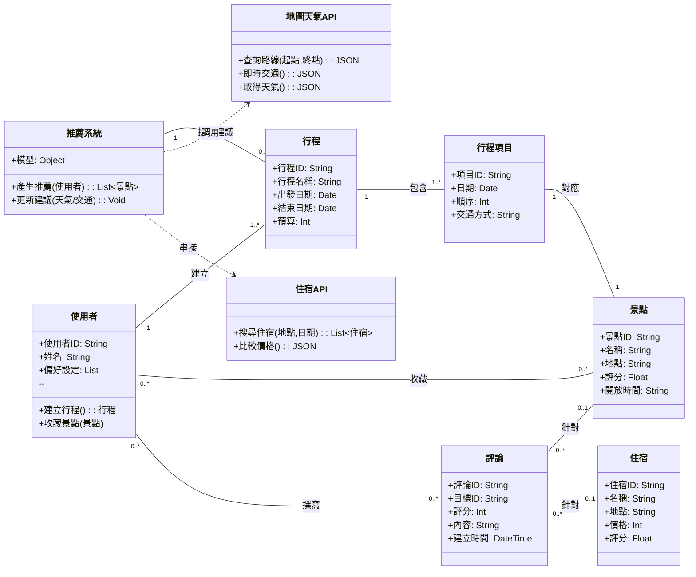
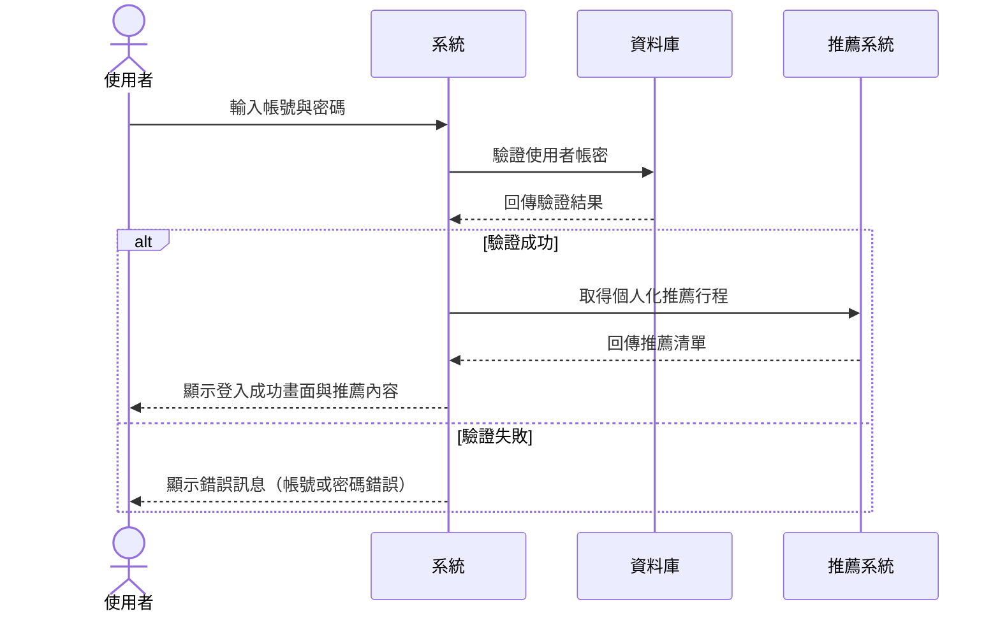
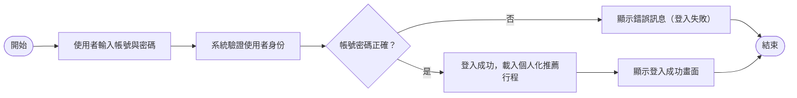
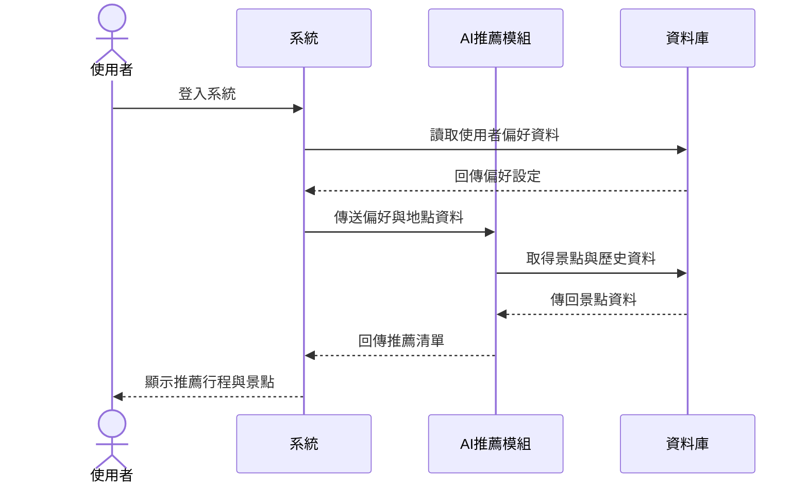
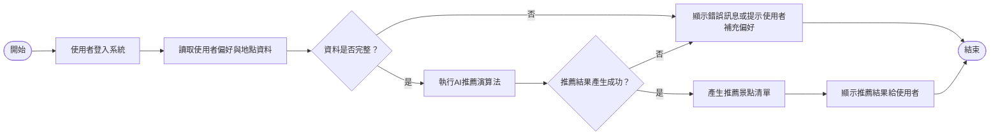
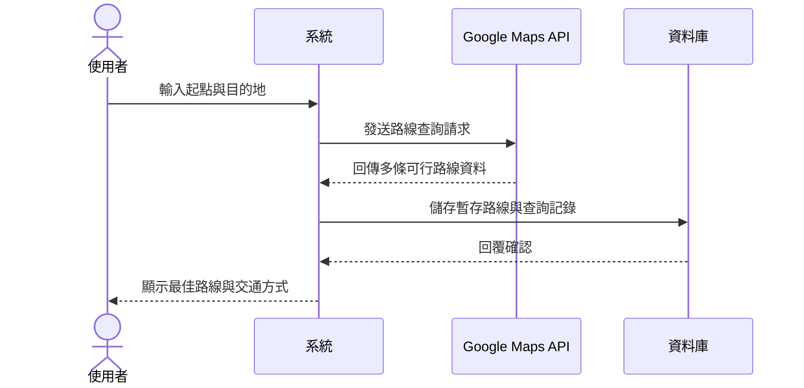
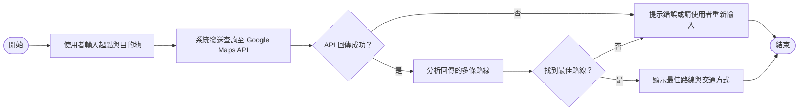
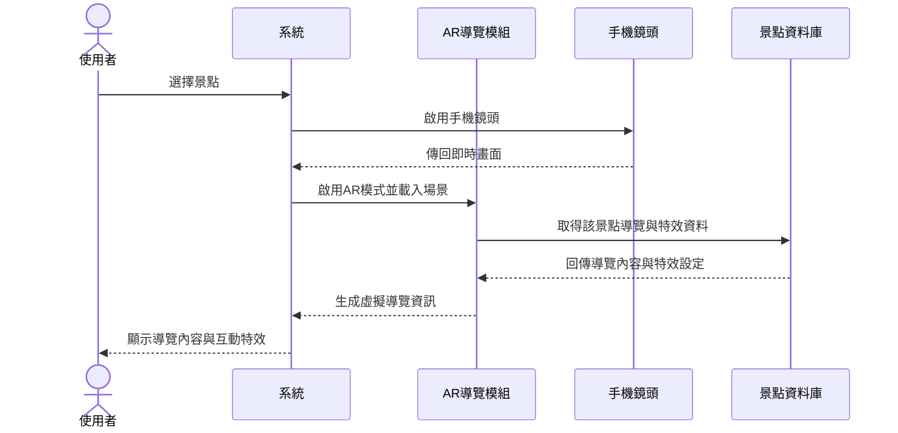
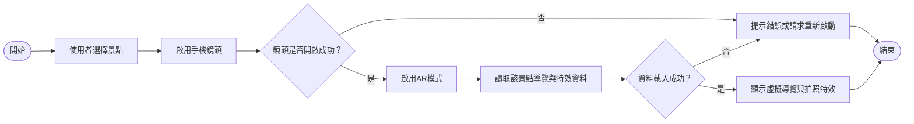

# UML類別圖

```mermaid
classDiagram
direction LR

%% === 左側：使用者與行程資料 ===
class 使用者 {
  +使用者ID: String
  +姓名: String
  +偏好設定: List
  --
  +建立行程(): 行程
  +收藏景點(景點)
}

class 行程 {
  +行程ID: String
  +行程名稱: String
  +出發日期: Date
  +結束日期: Date
  +預算: Int
}

class 行程項目 {
  +項目ID: String
  +日期: Date
  +順序: Int
  +交通方式: String
}

class 評論 {
  +評論ID: String
  +目標ID: String
  +評分: Int
  +內容: String
  +建立時間: DateTime
}

%% === 中央：旅遊與推薦核心 ===
class 景點 {
  +景點ID: String
  +名稱: String
  +地點: String
  +評分: Float
  +開放時間: String
}

class 住宿 {
  +住宿ID: String
  +名稱: String
  +地點: String
  +價格: Int
  +評分: Float
}

class 推薦系統 {
  +模型: Object
  +產生推薦(使用者): List~景點~
  +更新建議(天氣/交通): Void
}

%% === 右側：外部服務 ===
class 地圖天氣API {
  +查詢路線(起點,終點): JSON
  +即時交通(): JSON
  +取得天氣(): JSON
}

class 住宿API {
  +搜尋住宿(地點,日期): List~住宿~
  +比較價格(): JSON
}

%% === 關聯 ===
使用者 "1" -- "1..*" 行程 : 建立
行程 "1" -- "1..*" 行程項目 : 包含
行程項目 "1" -- "1" 景點 : 對應
使用者 "0..*" -- "0..*" 景點 : 收藏
使用者 "0..*" -- "0..*" 評論 : 撰寫
評論 "0..*" -- "0..1" 景點 : 針對
評論 "0..*" -- "0..1" 住宿 : 針對

推薦系統 "1" -- "0..*" 行程 : 提供建議
推薦系統 ..> 地圖天氣API : 調用
推薦系統 ..> 住宿API : 串接

```
## 使用案例 使用者登入系統
### 循序圖

```mermaid
sequenceDiagram
    actor 使用者
    participant 系統
    participant 資料庫
    participant 推薦模組 as 推薦系統

    使用者->>系統: 輸入帳號與密碼
    系統->>資料庫: 驗證使用者帳密
    資料庫-->>系統: 回傳驗證結果
    alt 驗證成功
        系統->>推薦模組: 取得個人化推薦行程
        推薦模組-->>系統: 回傳推薦清單
        系統-->>使用者: 顯示登入成功畫面與推薦內容
    else 驗證失敗
        系統-->>使用者: 顯示錯誤訊息（帳號或密碼錯誤）
    end
```
### 活動圖

```mermaid
flowchart LR
    A0([開始])
    A1[使用者輸入帳號與密碼]
    A2[系統驗證使用者身份]
    D1{帳號密碼正確？}
    A3[登入成功，載入個人化推薦行程]
    A4[顯示登入成功畫面]
    A5[顯示錯誤訊息（登入失敗）]
    A6([結束])

    A0 --> A1 --> A2 --> D1
    D1 -- 否 --> A5 --> A6
    D1 -- 是 --> A3 --> A4 --> A6

```

## 使用案例 AI 推薦景點
### 循序圖

```mermaid
sequenceDiagram
    actor 使用者
    participant 系統
    participant 推薦模組 as AI推薦模組
    participant 資料庫

    使用者->>系統: 登入系統
    系統->>資料庫: 讀取使用者偏好資料
    資料庫-->>系統: 回傳偏好設定
    系統->>推薦模組: 傳送偏好與地點資料
    推薦模組->>資料庫: 取得景點與歷史資料
    資料庫-->>推薦模組: 傳回景點資料
    推薦模組-->>系統: 回傳推薦清單
    系統-->>使用者: 顯示推薦行程與景點
```
### 活動圖

```mermaid
flowchart LR
    A0([開始])
    A1[使用者登入系統]
    A2[讀取使用者偏好與地點資料]
    D1{資料是否完整？}
    A3[執行AI推薦演算法]
    D2{推薦結果產生成功？}
    A4[產生推薦景點清單]
    A5[顯示推薦結果給使用者]
    A6[顯示錯誤訊息或提示使用者補充偏好]
    A7([結束])

    A0 --> A1 --> A2 --> D1
    D1 -- 否 --> A6 --> A7
    D1 -- 是 --> A3 --> D2
    D2 -- 否 --> A6
    D2 -- 是 --> A4 --> A5 --> A7

```
## 使用案例 動態更新路線建議
### 循序圖

```mermaid
sequenceDiagram
    actor 使用者
    participant 系統
    participant 地圖API as Google Maps API
    participant 資料庫

    使用者->>系統: 輸入起點與目的地
    系統->>地圖API: 發送路線查詢請求
    地圖API-->>系統: 回傳多條可行路線資料
    系統->>資料庫: 儲存暫存路線與查詢記錄
    資料庫-->>系統: 回覆確認
    系統-->>使用者: 顯示最佳路線與交通方式
```
### 活動圖

```mermaid
flowchart LR
    A0([開始])
    A1[使用者輸入起點與目的地]
    A2[系統發送查詢至 Google Maps API]
    D1{API 回傳成功？}
    A3[分析回傳的多條路線]
    D2{找到最佳路線？}
    A4[顯示最佳路線與交通方式]
    A5[提示錯誤或請使用者重新輸入]
    A6([結束])

    A0 --> A1 --> A2 --> D1
    D1 -- 否 --> A5 --> A6
    D1 -- 是 --> A3 --> D2
    D2 -- 否 --> A5
    D2 -- 是 --> A4 --> A6

```

## 使用案例 分享旅遊內容
### 循序圖

```mermaid
sequenceDiagram
    actor 使用者
    participant 系統
    participant AR模組 as AR導覽模組
    participant 鏡頭 as 手機鏡頭
    participant 景點資料庫

    使用者->>系統: 選擇景點
    系統->>鏡頭: 啟用手機鏡頭
    鏡頭-->>系統: 傳回即時畫面
    系統->>AR模組: 啟用AR模式並載入場景
    AR模組->>景點資料庫: 取得該景點導覽與特效資料
    景點資料庫-->>AR模組: 回傳導覽內容與特效設定
    AR模組-->>系統: 生成虛擬導覽資訊
    系統-->>使用者: 顯示導覽內容與互動特效
```

### 活動圖

```mermaid
flowchart LR
    A0([開始])
    A1[使用者選擇景點]
    A2[啟用手機鏡頭]
    D1{鏡頭是否開啟成功？}
    A3[啟用AR模式]
    A4[讀取該景點導覽與特效資料]
    D2{資料載入成功？}
    A5[顯示虛擬導覽與拍照特效]
    A6[提示錯誤或請求重新啟動]
    A7([結束])

    A0 --> A1 --> A2 --> D1
    D1 -- 否 --> A6 --> A7
    D1 -- 是 --> A3 --> A4 --> D2
    D2 -- 否 --> A6
    D2 -- 是 --> A5 --> A7
```

